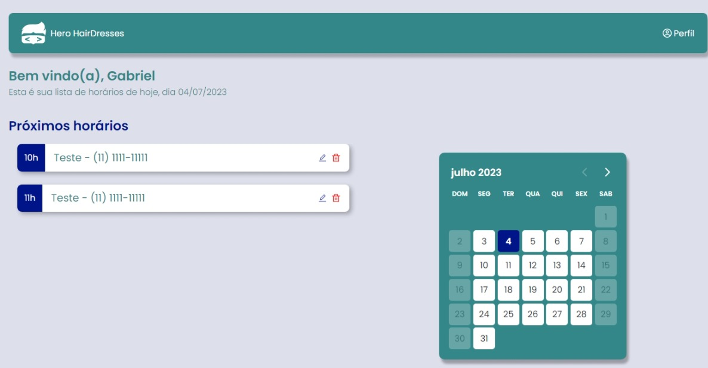

<strong><h1 align="center">Projeto HeroWeek</h1></strong>

  

## 🚀 Tecnologias

Projeto desenvolvido no evento semana do herói, um site de agendamentos de um salão de beleza. Esse projeto foi desenvolvido com as seguintes tecnologias:

Frontend:

- React
- ModuleCSS
- ContextAPI
- Typescript
- Day Picker

---

Backend:

- Node
- Express
- JWT
- Prisma
- SQLite

---

Feito com ♥ by [eugfl](https://www.linkedin.com/in/eugfl/)
